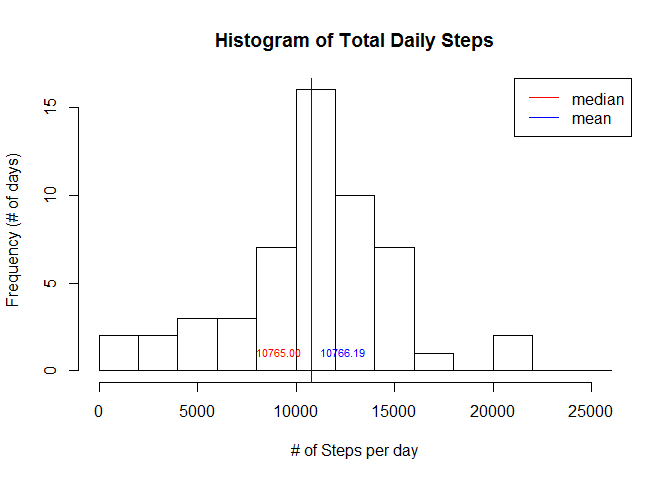
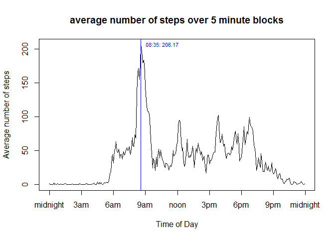
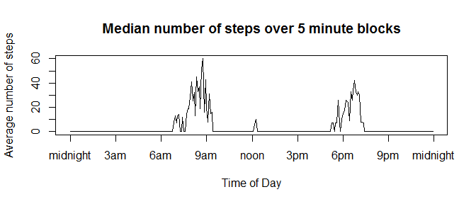
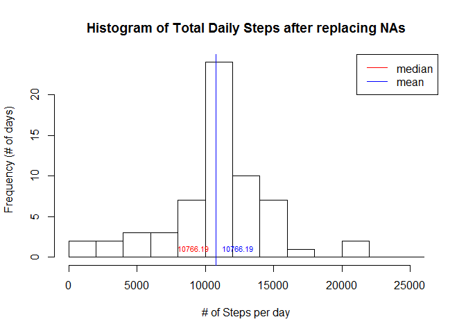
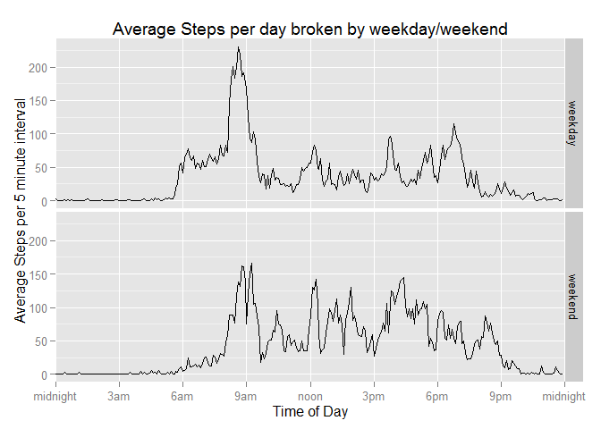
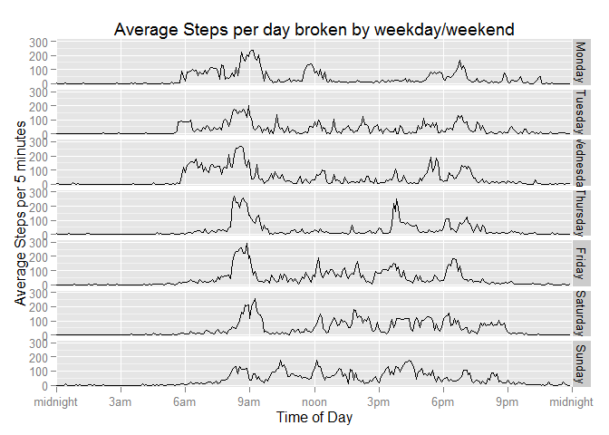

# Reproducible Research: Peer Assessment 1
## Introduction
This is my submission for Peer Assessment 1 of Reproducible Research based on the instructions in the README file.

First I need to check to see if the data is unziped, and if not unzip it.  This assumes the working directory is set correctly, but will download activity.zip from the location identified in the README if it's also missing.

```r
if(!file.exists("activity.csv")) {
    if(!file.exists("activity.zip")) {
        download.file("https://d396qusza40orc.cloudfront.net/repdata%2Fdata%2Factivity.zip", 
                      "activity.zip", mode="wb")
    }
    unzip("activity.zip")
}
```

It's also useful to load libraries I'm going to use here.  I'm also going to set some options that I feel improve the output farther down.

```r
library(dplyr, quietly=TRUE, warn.conflicts=FALSE)
library(ggplot2, quietly=TRUE)
library(gridExtra, quietly=TRUE)

options(scipen=2, digits=4)
```
I turned off warnings on conflicts for dplyr because I expect conflicts with filter, intersect, setdiff, setequal, and union.

## Loading and preprocessing the data
After reading the data in 2 steps are currently taken to preprocess the data for later analysis:

1. converting the date field to the Date type
2. building a time of day (hour:minute) from the interval
3. building a block number that is continuous and evenly spaced to support better timeseries plots.


```r
act.data <- read.csv("activity.csv")
act.data$date <- as.Date(act.data$date)
act.data$time <- sprintf("%02d:%02d", 
                         floor(act.data$interval/100),
                         act.data$interval%%100)
act.data$block <- 60*floor(act.data$interval/100) + act.data$interval%%100
```

## What is mean total number of steps taken per day?

```r
## first build the summaries and statistics to be used in this section
daily.activity <- group_by(act.data, date) %>% summarize(daily.steps=sum(steps), na.activity=sum(is.na(steps)))

mean.steps <- mean(daily.activity$daily.steps, na.rm=TRUE)
sd.steps <- sd(daily.activity$daily.steps, na.rm=TRUE)
median.steps <- quantile(daily.activity$daily.steps, probs=0.5, na.rm=TRUE)
```
The number of steps per day was distributed around the mean of **10766.1887** with a standard deviation of 4269.1805.  The median of **10765** reflects slightly more below average days than above average days, with a few days with exceptionally high step counts.  

The histogram below shows the distribution of days across 2000 step breaks.  There are lines representing the mean and median in the graph, but they're too close to distinguish.


```r
with(daily.activity,
     hist(daily.steps, 
          breaks=seq(0,26000,2000),
          xlab="# of Steps per day",
          ylab="Frequency (# of days)",
          main="Histogram of Total Daily Steps"
          )
     )
abline(v=median.steps, col="red")
text(x=median.steps, y=1,
     labels=sprintf("%.2f", median.steps),
     pos=2,
     col="red",
     cex=0.7
     )
abline(v=mean.steps, col="blue")
text(x=mean.steps, y=1,
     labels=sprintf("%.2f", mean.steps),
     pos=4,
     col="blue",
     cex=0.7
     )
legend("topright", 
       legend=c("median", "mean"), 
       col=c("red", "blue"),
       lwd=c(1,1)
       )
```

 


## What is the average daily activity pattern?

```r
## first build the summaries and statistics needed for this section
time.activity <- group_by(act.data, block) %>% 
    summarize(ave.steps=mean(steps, na.rm=TRUE), 
              med.steps=quantile(steps, probs=0.5, na.rm=TRUE),
              time=min(time))

max.time <- which.max(time.activity$ave.steps)
```

There were very few steps taken overnight (between 9pm and 6am).  THe 5 minute block with the most steps was **08:35** with 206.1698 taken on average during that time period.  There were also notable peaks at roughly noon, 4pm, and 7pm.  The average number of steps per 5 minutes jumps rapidly starting around 5:30 am and trails off after 7:30pm.


```r
with(time.activity,{
     plot(block, ave.steps, type="l", xaxt="n",
          xlab="Time of Day", ylab="Average number of steps",
          main="average number of steps over 5 minute intervals") 
     axis(side=1, 
          at=60*c(0,3,6,9,12,15,18,21,24), 
          labels=c("midnight", "3am", "6am", "9am", "noon", "3pm", "6pm", "9pm", "midnight"))
     
     ## the following adds a gray line showing the median
     ## this may confuse the chart, but was useful knowledge
     # points(block, med.steps, type="l", col="gray")
     })
abline(v=time.activity[max.time, "block"], col="blue")
text(x=time.activity[max.time,"block"], 
     y=time.activity[max.time,"ave.steps"], 
     labels=sprintf("%s: %.2f", 
                    time.activity[max.time, "time"],
                    time.activity[max.time, "ave.steps"]),
     pos=4,
     col="blue",
     cex=0.7
     )
```

 

## Imputing missing values

```r
## first build the summaries and statistics
total.na <- sum(is.na(act.data$steps))
na.events <- filter(act.data, is.na(steps))
na.days <- group_by(na.events, date) %>% summarize(natimes=sum(is.na(steps)))
na.times <- group_by(na.events, time) %>% summarize(natimes=sum(is.na(steps)))

na.days
```

```
## Source: local data frame [8 x 2]
## 
##         date natimes
## 1 2012-10-01     288
## 2 2012-10-08     288
## 3 2012-11-01     288
## 4 2012-11-04     288
## 5 2012-11-09     288
## 6 2012-11-10     288
## 7 2012-11-14     288
## 8 2012-11-30     288
```

```r
summary(na.times)
```

```
##      time              natimes 
##  Length:288         Min.   :8  
##  Class :character   1st Qu.:8  
##  Mode  :character   Median :8  
##                     Mean   :8  
##                     3rd Qu.:8  
##                     Max.   :8
```
There are **2304** events where the number of steps was not recorded.  They are distributed on 8 days and fill all the timeslots on those days. 

I considered the impact of using the median number of steps for a 5 minute block.  However, as can be seen in the following chart, most intervals had no activity more than half the time significantly biasing overall patterns of daily activity.


```r
with(time.activity,{
     plot(block, med.steps, type="l", xaxt="n",
          xlab="Time of Day", ylab="Average number of steps",
          main="Median number of steps over 5 minute blocks") 
     axis(side=1, 
          at=60*c(0,3,6,9,12,15,18,21,24), 
          labels=c("midnight", "3am", "6am", "9am", "noon", "3pm", "6pm", "9pm", "midnight"))
     })
```

 

Because the median values for the different times are significantly lower than the averages, the median times would substantially underweight random movement done during a day.  Therefore, I'll use the average value for a timeslot to fill in for NA values in the original data.


```r
## first make a copy
new.act <- act.data

## because the missing data is missing for entire days at a time
## I could just drop in the time.activity$med.steps vector
## that's not generally safe, so I'll first make a vector of steps
## based on matching block values then assign it to the steps

## I have to do this as a loop
while(sum(is.na(new.act))>0) {
    new.act[which(is.na(new.act$steps)),"steps"] <-
        time.activity[time.activity$block ==
                         new.act[which(is.na(new.act$steps)),"block"],
                      "ave.steps"]
}

## redo steps from the first section 
## except with new.act instead of act.data
## first build the summaries and statistics to be used in this section
daily.activity2 <- group_by(new.act, date) %>% summarize(daily.steps=sum(steps), na.activity=sum(is.na(steps)))

mean.steps2 <- mean(daily.activity2$daily.steps)
sd.steps2 <- sd(daily.activity2$daily.steps)
median.steps2 <- quantile(daily.activity2$daily.steps, probs=0.5)
```
After replacing NA values with average values for that time, the number of steps per day was distributed around the mean of **10766.1887** with a standard deviation of 3974.3907.  The median of **10766.1887** now matches the mean, indicating that replacing the NA values created enough perfectly average days to shift the median to that value.

The histogram below shows the distribution of days across 2500 step breaks.


```r
with(daily.activity2,
     hist(daily.steps, 
          breaks=seq(0,26000,2000),
          xlab="# of Steps per day",
          ylab="Frequency (# of days)",
          main="Histogram of Total Daily Steps after replacing NAs"
          )
     )
abline(v=median.steps2, col="red")
text(x=median.steps2, y=1,
     labels=sprintf("%.2f", median.steps2),
     pos=2,
     col="red",
     cex=0.7
     )
abline(v=mean.steps2, col="blue")
text(x=mean.steps2, y=1,
     labels=sprintf("%.2f", mean.steps2),
     pos=4,
     col="blue",
     cex=0.7
     )
legend("topright", 
       legend=c("median", "mean"), 
       col=c("red", "blue"),
       lwd=c(1,1)
       )
```

 

By adding several identical values to the exact center of the graph, the mean did not change, but the median did.

## Are there differences in activity patterns between weekdays and weekends?

```r
## first tag weekdays and weekends
new.act$weekday <- ordered(weekdays(new.act$date), c("Monday", "Tuesday", "Wednesday", "Thursday", "Friday", "Saturday", "Sunday"))
new.act$workweek <- ifelse(new.act$weekday %in% c("Saturday", "Sunday"), "weekend", "weekday")
new.act$workweek <-factor(new.act$workweek)

weekly.activity <- group_by(new.act, workweek, block) %>% 
    summarize(ave.steps=mean(steps, na.rm=TRUE), 
              med.steps=quantile(steps, probs=0.5, na.rm=TRUE),
              time=min(time))
```

There are significant difference between the patterns of activity seen on weekdays and weekends as seen in the plots below:


```r
g <- ggplot(data=weekly.activity, 
            aes(x=block, y=ave.steps, group=workweek))
p <- g + facet_grid(workweek ~.) + geom_line() + 
    scale_x_discrete(
        breaks=60*c(0,3,6,9,12,15,18,21,24),
        labels=c("midnight", "3am", "6am", "9am", "noon", "3pm", "6pm", "9pm", "midnight")
        ) + expand_limits(x=60*24) + 
    xlab("Time of Day") + ylab("Average Steps per 5 minute interval") + 
    ggtitle("Average Steps per day broken by weekday/weekend")
print(p)
```

 

Because I was curious I also looked at differences among the individual days and found that Thursday and Friday also differed from the earlier days in the week.


```r
weekday.activity <- group_by(new.act, weekday, block) %>% 
    summarize(ave.steps=mean(steps, na.rm=TRUE), 
              med.steps=quantile(steps, probs=0.5, na.rm=TRUE),
              time=min(time))

g2 <- ggplot(data=weekday.activity, 
            aes(x=block, y=ave.steps, group=weekday))
p2 <- g2 + facet_grid(weekday ~.) + geom_line() + 
    scale_x_discrete(
        breaks=60*c(0,3,6,9,12,15,18,21,24),
        labels=c("midnight", "3am", "6am", "9am", "noon", "3pm", "6pm", "9pm", "midnight")
        ) + expand_limits(x=60*24) + 
    xlab("Time of Day") + ylab("Average Steps per 5 minutes") + 
    ggtitle("Average Steps per day broken by weekday/weekend")
print(p2)
```

 
